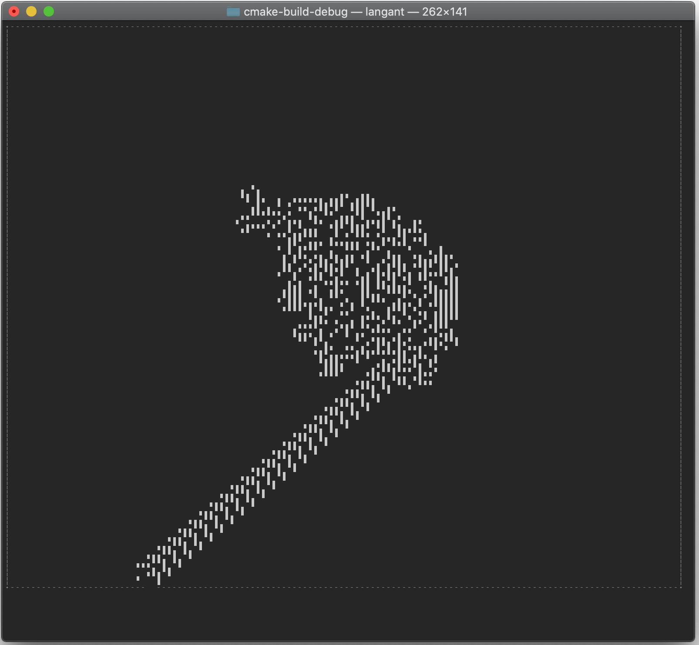
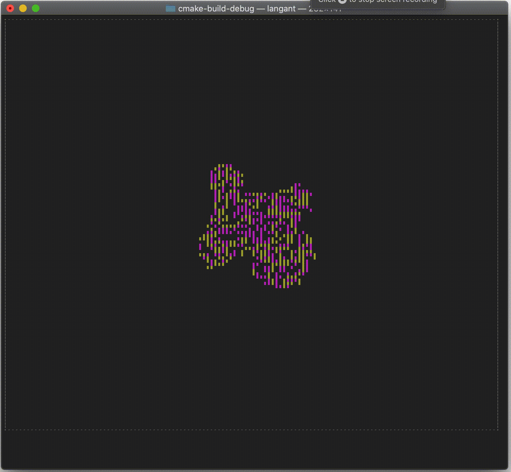
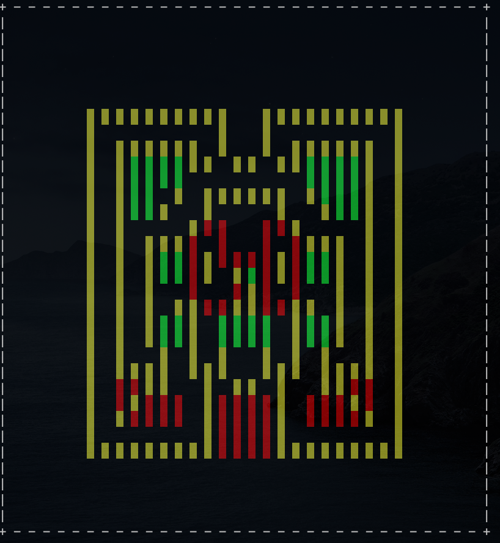
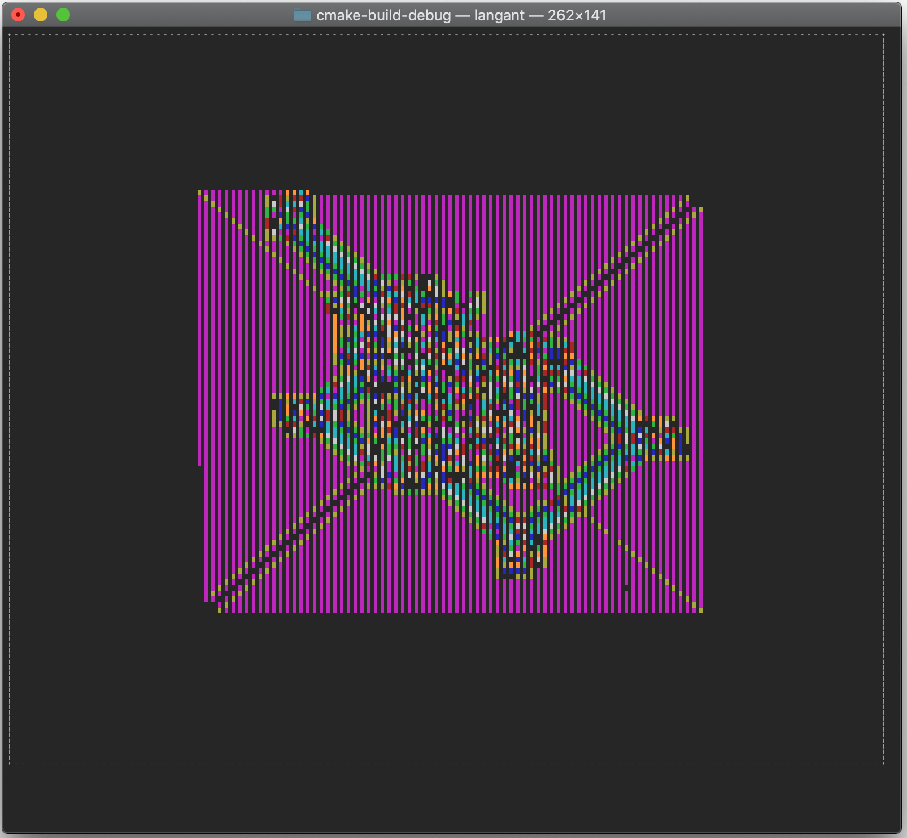

# langant-c
An ncurses Langton's Ant implementation made in C

### How to modify:

To change the number of rules, change the following variables:

- rules  -->  game.c @ line 9

 - colors  -->  game.c @ line 10

Always ensure the rules and colors arrays are the same size.

To change the size of the simulation:

- SIZE  -->  game.h @ line 8

The size of each cell is dependent on your terminal's font size, meaning large game sizes will only be able to be seen by reducing terminal's font size, and even some game sizes won't be able to be seen due to terminal font size minimum limit.

Screen refreshes are minimized for optimization purposes (reducing draw calls), meaning resizing the terminal during simulation leads to undefined behaviour.

### Controls
 *  [q] quit
 *  [SCROLL / (UP/DOWN)] change game speed